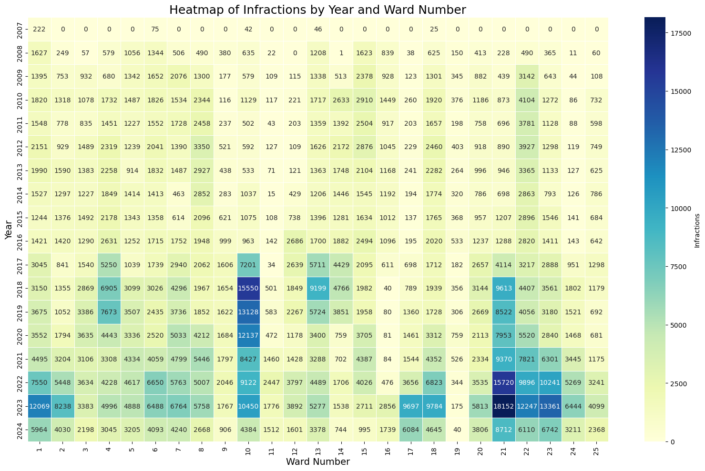
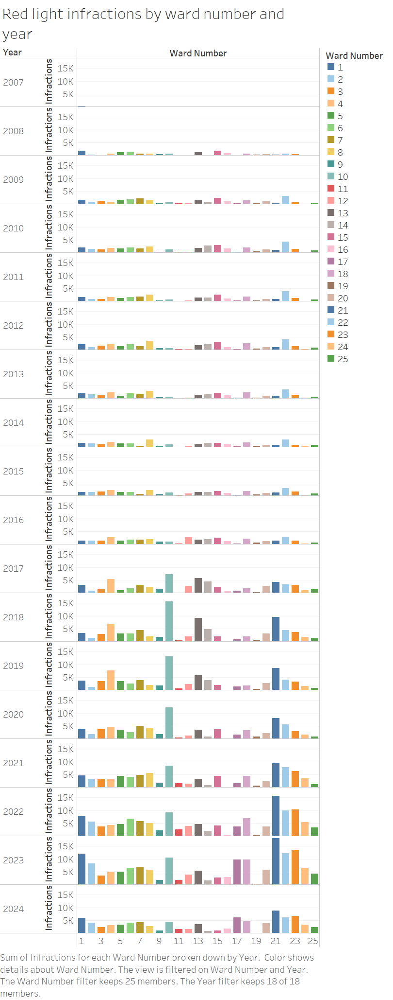

# Data Visualization

## Assignment 4: Final Project

### Requirements:
- We will finish this class by giving you the chance to use what you have learned in a practical context, by creating data visualizations from raw data. 
- Choose a dataset of interest from the [City of Toronto’s Open Data Portal](https://www.toronto.ca/city-government/data-research-maps/open-data/) or [Ontario’s Open Data Catalogue](https://data.ontario.ca/). 
- Using Python and one other data visualization software (Excel or free alternative, Tableau Public, any other tool you prefer), create two distinct visualizations from your dataset of choice.  
- For each visualization, describe and justify: 
    > What software did you use to create your data visualization?
    
    I utilized Python seaborn library and Tableau.

    > Who is your intended audience? 
    
    My intended audience includes city planners, transportation engineers, and policymakers, but also the general public.

    > What information or message are you trying to convey with your visualization? 
    
    The Seaborn bar plot is designed to show the annual trends in red light infractions across different wards. It highlights whether infractions are increasing or decreasing over time, helping stakeholders track the effectiveness of traffic safety measures or enforcement campaigns.
    
    The Tableau interactive dashboard provides users with a detailed look at infractions by ward and year, allowing them to filter data and explore the relationship between specific wards and the frequency of red light violations. This tool helps viewers identify high-incidence areas and can be used to prioritize enforcement or policy changes.

    > What design principles (substantive, perceptual, aesthetic) did you consider when making your visualization? How did you apply these principles? With what elements of your plots? 
    
     Both visualizations were designed to provide clear insights into traffic safety. The focus is on making the data actionable, so decision-makers can use the findings to improve traffic regulations and enforcement strategies.

     I used color contrast and size variation in the heatmap to emphasize significant changes in red light infractions over time. For the Tableau dashboard, I applied interactive filtering and tooltips to allow users to explore data in a more intuitive and personalized way, especially when you hover over it.

    I kept the heatmap design simple and clean, avoiding clutter while ensuring the color contrast is accessible to viewers, including those with colorblindness. In Tableau, I used a minimalist bar chart design, ensuring the interactive elements are straightforward and visually distinct.

    > How did you ensure that your data visualizations are reproducible? If the tool you used to make your data visualization is not reproducible, how will this impact your data visualization? 
    
    The Seaborn heatmap is fully reproducible by sharing the Python code, which includes the necessary steps to load, clean, and visualize the data using Seaborn and pandas. The Tableau dashboard is also reproducible by sharing the Tableau Public workbook or by providing the dataset, which allows anyone to recreate the visualization with the same tool. However, I did not use Tableau public but used a paid version so the reproducibility is lacking in this category.

    > How did you ensure that your data visualization is accessible?  
    
    For the Seaborn heatmap, I used a color palette that is both colorblind-friendly and provides clear contrast between different bars. I also ensured that all axes were labeled properly, and a title was added for context.
    
    In the Tableau dashboard, I made sure that the interactive elements (such as filters and tooltips) are easily navigatable. The design is responsive to ensure it works well on different screen sizes, and I included text-based explanations of the data to accommodate viewers who might rely on screen readers.
    
    > Who are the individuals and communities who might be impacted by your visualization?  
    
    Residents of Toronto, local government officials, traffic enforcement agencies, and urban researchers may be impacted by my visualization.    

    > How did you choose which features of your chosen dataset to include or exclude from your visualization? 
    
    For both visualizations, I focused on including ward names, years, and red light infraction counts. These features are essential for answering the key questions about geographical and temporal patterns in the data. I excluded features that were less directly relevant to the analysis, such as detailed violation types or specific traffic conditions, to keep the visualizations clear and focused.

    > What ‘underwater labour’ contributed to your final data visualization product?

    For the Seaborn heatmap, the 'underwtaer labour' involved data cleaning, particularly handling missing values, ensuring data consistency, and aggregating the red light infractions by ward and year. Additionally, I spent time choosing the right color palette to ensure the heatmap was both informative and accessible.

    In Tableau, I spent significant time designing the interactive dashboard. This involved setting up filters, designing tooltips, and adjusting the layout for a clean user interface. I also spent time optimizing the dashboard for performance, ensuring that it loads efficiently even when users filter through large datasets.

- This assignment is intentionally open-ended - you are free to create static or dynamic data visualizations, maps, or whatever form of data visualization you think best communicates your information to your audience of choice! 
- Total word count should not exceed **(as a maximum) 1000 words** 

Source: https://open.toronto.ca/dataset/red-light-camera-annual-charges/ 
 
### Why am I doing this assignment?:  
- This ongoing assignment ensures active participation in the course, and assesses the learning outcomes: 
* Create and customize data visualizations from start to finish in Python
* Apply general design principles to create accessible and equitable data visualizations
* Use data visualization to tell a story  
- This would be a great project to include in your GitHub Portfolio – put in the effort to make it something worthy of showing prospective employers!

### Rubric:

| Component         | Scoring  | Requirement                                                                 |
|-------------------|----------|-----------------------------------------------------------------------------|
| Data Visualizations | Complete/Incomplete | - Data visualizations are distinct from each other - Data visualizations are clearly identified - Different sources/rationales (text with two images of data, if visualizations are labeled) - High-quality visuals (high resolution and clear data) - Data visualizations follow best practices of accessibility |
| Written Explanations | Complete/Incomplete | - All questions from assignment description are answered for each visualization - Explanations are supported by course content or scholarly sources, where needed |
| Code              | Complete/Incomplete | - All code is included as an appendix with your final submissions - Code is clearly commented and reproducible |

## Submission Information

🚨 **Please review our [Assignment Submission Guide](https://github.com/UofT-DSI/onboarding/blob/main/onboarding_documents/submissions.md)** 🚨 for detailed instructions on how to format, branch, and submit your work. Following these guidelines is crucial for your submissions to be evaluated correctly.

### Submission Parameters:
* Submission Due Date: `HH:MM AM/PM - DD/MM/YYYY`
* The branch name for your repo should be: `assignment-4`
* What to submit for this assignment:
    * A folder/directory containing:
        * This file (assignment_4.md)
        * Two data visualizations 
        * Two markdown files for each both visualizations with their written descriptions.
        * Link to your dataset of choice.
        * Complete and commented code as an appendix (for your visualization made with Python, and for the other, if relevant) 
* What the pull request link should look like for this assignment: `https://github.com/<your_github_username>/visualization/pull/<pr_id>`
    * Open a private window in your browser. Copy and paste the link to your pull request into the address bar. Make sure you can see your pull request properly. This helps the technical facilitator and learning support staff review your submission easily.

Checklist:
- [ ] Create a branch called `assignment-4`.
- [ ] Ensure that the repository is public.
- [ ] Review [the PR description guidelines](https://github.com/UofT-DSI/onboarding/blob/main/onboarding_documents/submissions.md#guidelines-for-pull-request-descriptions) and adhere to them.
- [ ] Verify that the link is accessible in a private browser window.

If you encounter any difficulties or have questions, please don't hesitate to reach out to our team via our Slack at `#cohort-3-help`. Our Technical Facilitators and Learning Support staff are here to help you navigate any challenges.
